# Agentic Ebook Platform V3 — Diagram Pack

This document provides Mermaid diagrams for the Agentic Ebook Platform V3.

It includes:
- high-level application block diagrams
- component-level block diagrams
- sequence diagrams for key process flows

These diagrams assume the V3 target architecture uses AWS Step Functions for workflow orchestration, EventBridge Scheduler for per-topic scheduling, DynamoDB for operational metadata, Amplify Hosting for the public and admin web applications, API Gateway JWT authorization for admin APIs, and the OpenAI Responses API with an optional OpenAI Agents SDK layer for multi-agent execution.

---

## 1. High-Level Application Block Diagram

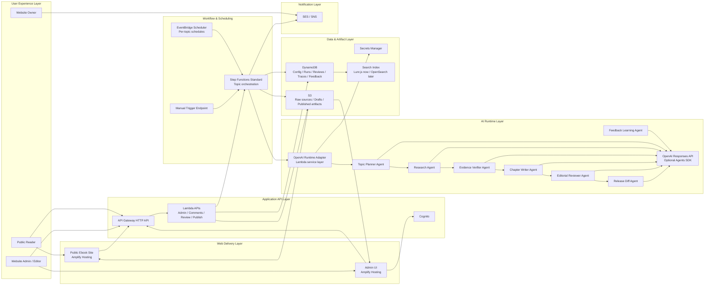

---

## 2. Logical Block Diagram by Major Domains

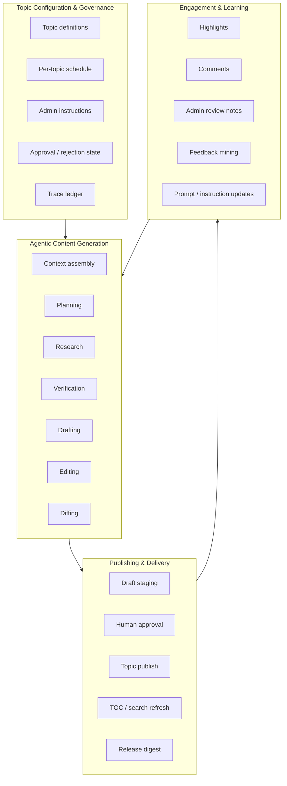

---

## 3. Component Block Diagram — Admin & Public Web Layer

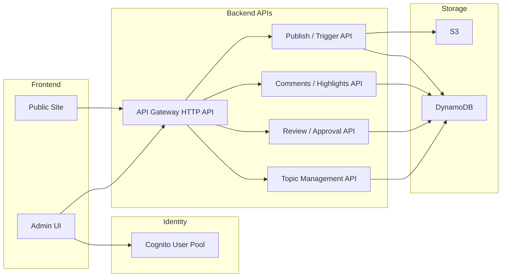

---

## 4. Component Block Diagram — Agentic Execution Layer

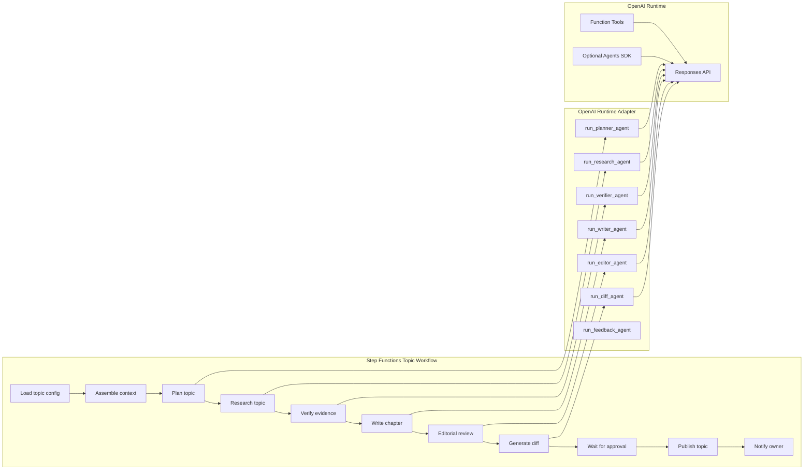

---

## 5. Component Block Diagram — Data & Traceability

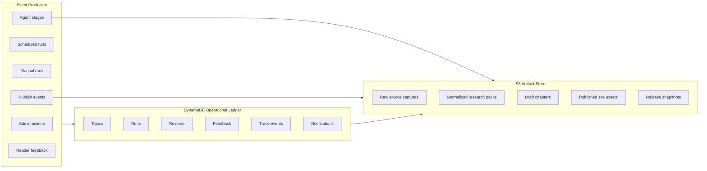

---

## 6. Sequence Diagram — Create or Update Topic Configuration

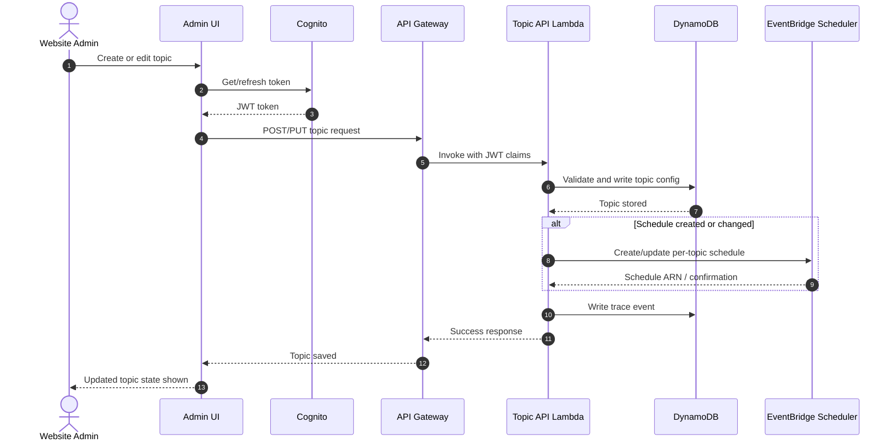

---

## 7. Sequence Diagram — Scheduled Topic Run

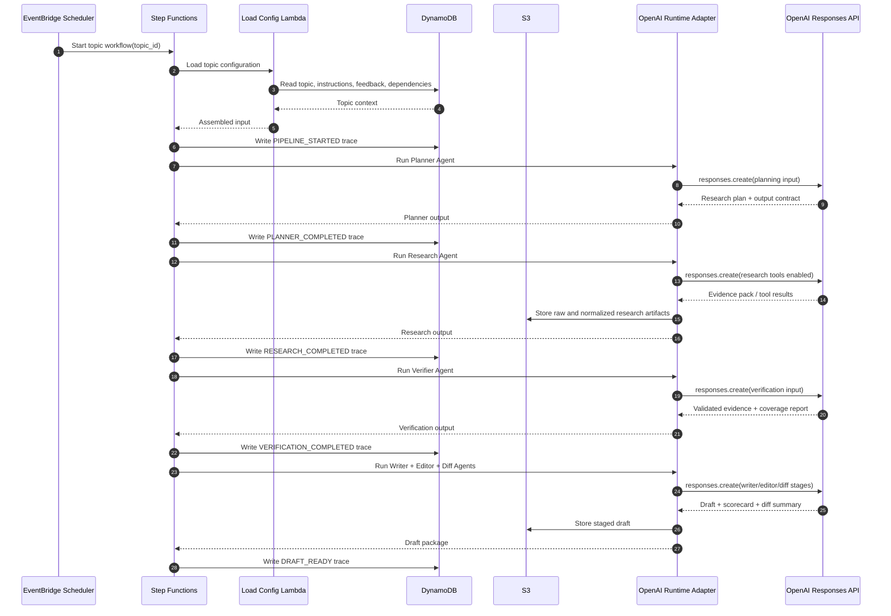

---

## 8. Sequence Diagram — Manual Trigger Topic Run

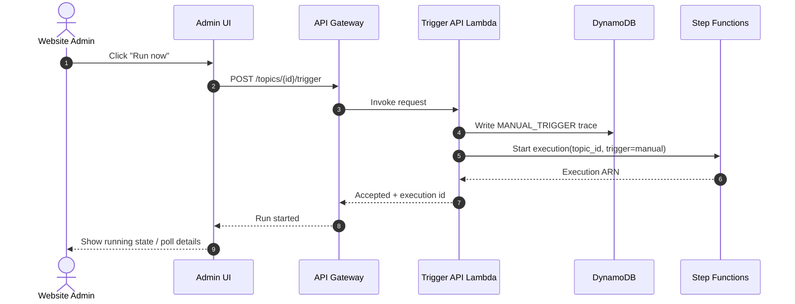

---

## 9. Sequence Diagram — Multi-Agent Research and Drafting Flow

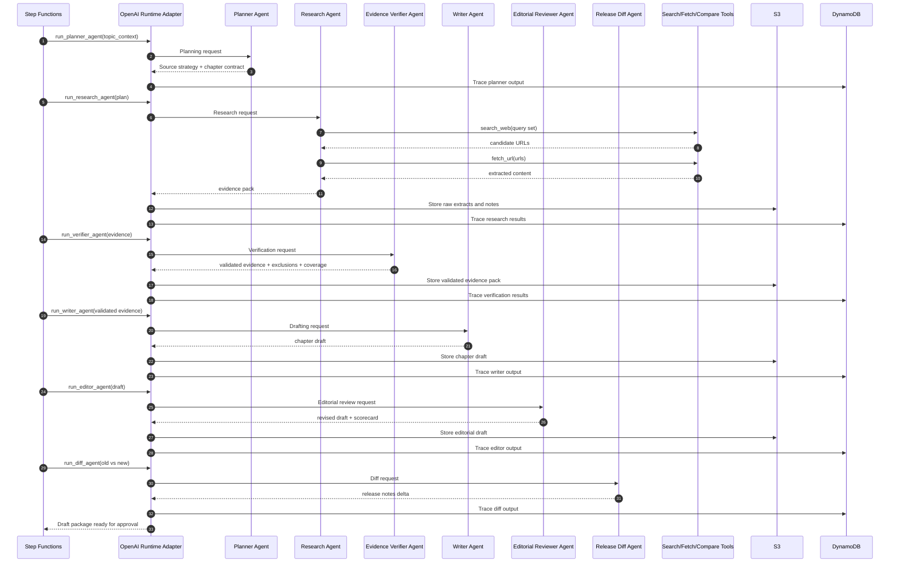

---

## 10. Sequence Diagram — Approval, Rejection, and Callback Resume

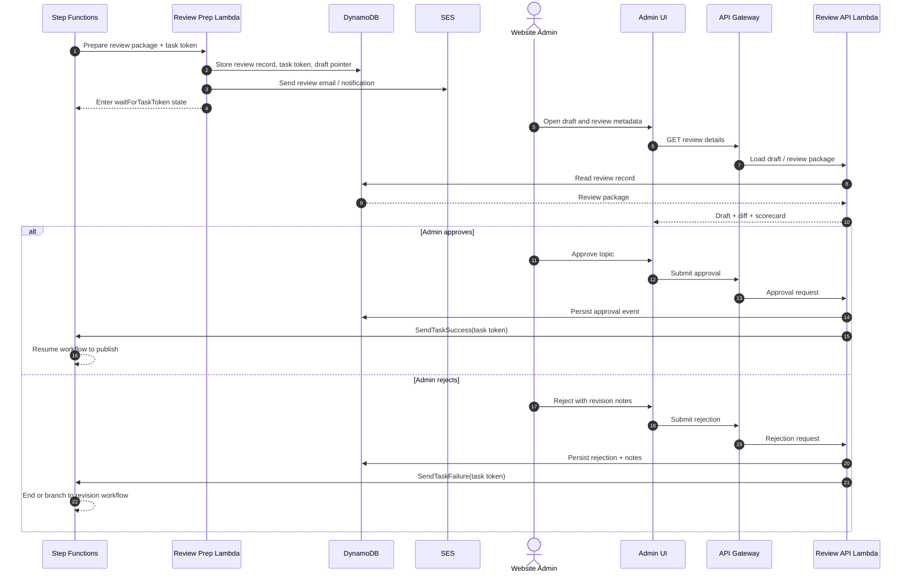

---

## 11. Sequence Diagram — Publish Approved Topic and Refresh Shared Assets

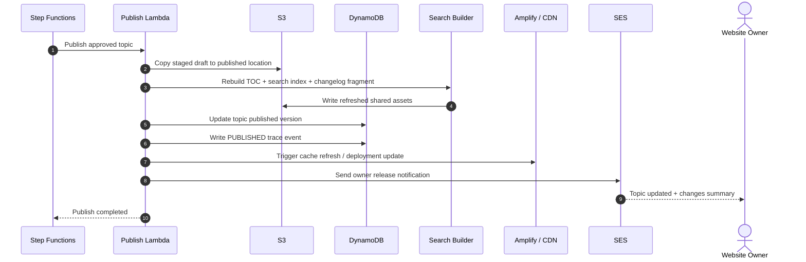

---

## 12. Sequence Diagram — Reader Highlights, Comments, and Feedback Learning

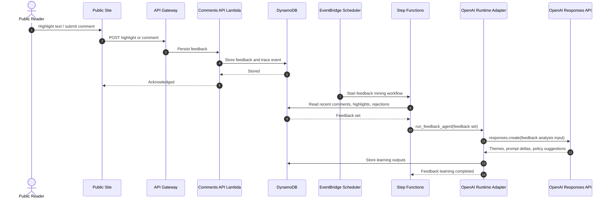

---

## 13. Sequence Diagram — Weekly Release Digest for Owner

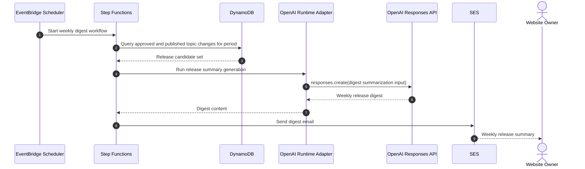

---

## 14. Block Diagram — Topic Lifecycle

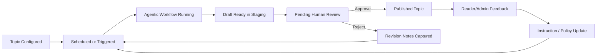

---

## 15. Block Diagram — Feedback Learning Subsystem

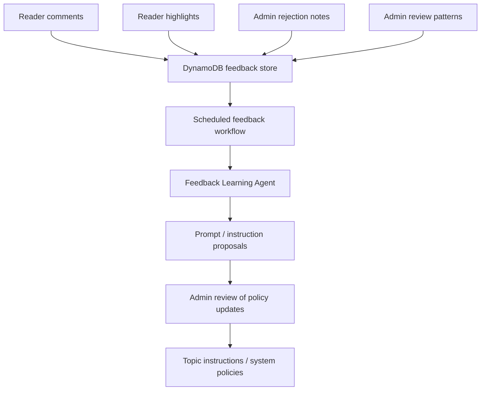

---

## 16. Block Diagram — Publish & Delivery Subsystem

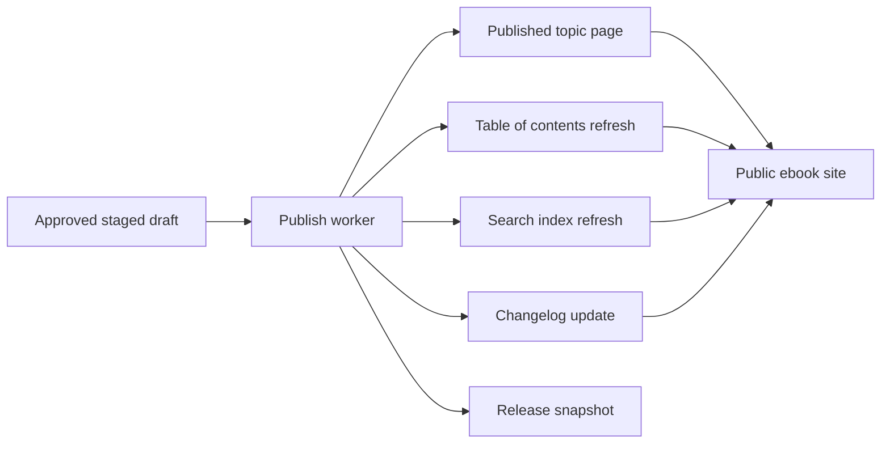

---

## 17. Suggested Usage

- Use these Mermaid diagrams directly in GitHub, Markdown previews, Confluence markdown renderers, or documentation portals that support Mermaid.
- For presentations, export them into SVG/PNG or redraw selected diagrams in a slide-native format.
- For implementation docs, keep the high-level block diagram, topic workflow sequence, approval flow, and feedback learning flow as the core set.

